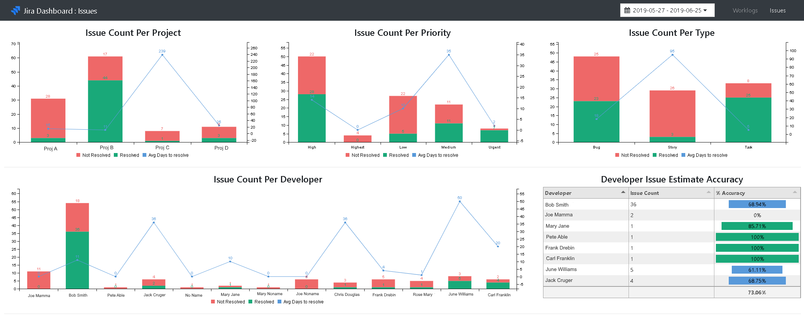
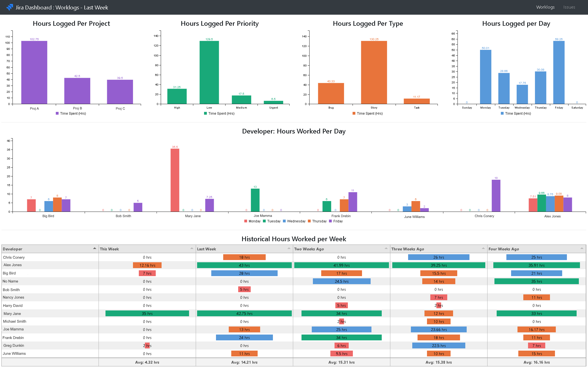

# JiraWorklog

Simple utility to extract all Jira Worklogs and record them into a database so they can be easily reported on. This is a self contained solution that will collect all of the worklogs and present a simple dashboard as the presentation layer

Currently two databases are supported. BoltDB and MS SQL Server. This is configured via the command line with boltDB being the default option.

For SQL Server its expected that the database and tables already exist. See below for table schema





## Reasons why this is needed

Jira does not provide a good way to see developers productivity across all projects

Time tracking is typically done at the lowest issue level. For a bug that makes sense. For a
story many times the time tracking is logged against the sub-task. From a management level we care more
about the "parent issues" when it comes to seeing what was completed / worked on

The assignee gets changed over time (QA for example) so you really don't know what developer worked on what issue unless you dig into the history of an issue.

The existing reports in Jira don't provide good insight into productivity of developers unless you use
a jira plug-in that costs money and could change the standard jira time tracking functionality. I wanted
this to work with the default jira time tracking solution (work logs)

The current reporting options in Jira Cloud are somewhat limiting and unless you purchase an add-on the
time spent by developers is difficult to report on. This utility is looking to change that.

If you follow [https://en.wikipedia.org/wiki/Pomodoro_Technique](the pomodoro technique) and wish to log your work many times a day to various issues, it is imperative to be able to tell how much work you logged so far. With stock Jira, it is practically impossible to deduct.

## Configuration

- jira: all values are required to pull worklogs from Jira
- sqlconnection: (optinal) only needed if you are using SQL Server as database
- maxworklogid: As the service runs this will be automatically updated tracking the last worklog processed (don't modify unless you want to reset and process all worklogs again)
- lasttimestamp: last timestamp pulled from Jira for the max worklog processed (don't modify unless you want to reset and process all worklogs agian)
- userlist: (Optional) If userlist populated it will only pull worklogs for the given users
- donestatus: If Jira is misconfigured and resolution dates are not always populated this provides a simple way to ensure the issue is marked as "resolved" based off these statuses. This is only used when the resolution date is not being populated

```sh
jira:
  url: https://yoursubdomain.atlassian.net/rest/api/3
  username: your.username@example.com
  password: ideally_use_api_token
sqlconnection: Server=server;Database=jira;User Id=sa;Password=password
maxworklogid: 0
lasttimestamp: 0
userlist:
- big.bird
- donald.duck
donestatus:
- done
- closed
```

## Command line help

```sh
$ ./jiraworklog.exe --help
Usage: jiraworklog.exe OPTIONS

OPTIONS

-c, --config <config.yaml>  path to configuration file
-h, --help                  print help and exit
-p, --port <8180>           default port to serve rest API from (default: 8180)
-r, --repo <BOLTDB>         specific repo to use (MSSQL, BOLTDB) (default: BOLTDB)
-a, --ask                   Ask for Jira username and password from the STDIN
-v, --verbose               verbose logging
```

## Environment values

You can override values from the configuration file using the ENV.

### Example

JWL_JIRA_URL=> Config.Jira.URL
Only JWL_JIRA_* are currently supported

### Usage

```
JWL_JIRA_USERNAME="urho" JWL_JIRA_PASSWORD="kekkonen" ./jiraworklog
```

## Running for the first time

### Linux or Windows

 - Execute the jiraworklog executable without any parameters. Note: The first time you run this it will warn you that a configuration file was not present but one has been created for you.

 - Edit the config.yaml file accordingly

 ```sh
 # BoltDB database
 ./jiraworklog -v

 # SQL Server database
 ./jiraworklog -v -r MSSQL
 ```

### Docker

- Ensure you have created your config.yaml file

Note: Unless you change the port it will default to 8180

```sh

# Run using BoltDB
docker run -d --restart unless-stopped --name jiraworklog -p 8180:8180 --mount type=bind,source="$(pwd)"/config.yaml,target=/app/config.yaml mkobaly/jiraworklogs ./jiraworklog -v

## Run using SQL Server
docker run -d --restart unless-stopped --name jiraworklog -p 8180:8180 --mount type=bind,source="$(pwd)"/config.yaml,target=/app/config.yaml mkobaly/jiraworklogs ./jiraworklog -r MSSQL -v

```

Once service has slowed down in importing worklogs and issues you can navigate to http://localhost:8180/issues.html to see the dashboard

## Workflow

Jira should be easy to use but its not. Here we are assuming 1 simple rule.

1) Developers log their time on tickets they work on.

Given that we can pull all work log entries and from those entries get the issue and the parent issue (ex: sub-task => story), we now know all of the "parent issues" being worked on and can track when those parent issues are resolved


## Rest API

- /worklogs - get all worklogs (todo: add paging)
- /worklogs/groupby
- /worklogs/perdev
- /worklogs/perdevweek

- /issues - get all issues (todo: add paging)
- /issues/groupby - issue data going back x days group by given value
- /issues/accuracy

## dashboard Thoughts (WIP)

### Get parameters

./issues.html and ./worklogs.html can be parametrized to preload a desired timeframe, eg.

- ./issues.html?start=lastweek
- ./issues.html?start=2021-12-08&end=2021-12-24
- ./issues.html  # loads the current week

### Issues

Accessed by http://localhost:8180/issues.html

- Historical page?
  - The days to complete by type line chart below could fit here
  - Pivot result of per developer past 6 weeks, hours worked per week


issues by type: avg days to resolve (ones that are closed)

per developer: %accuracy on estimate

all developers: %accuracy (guage)

List - Issues not closed and older than x days

Days to complete by type
 - line chart going back 6 weeks. Each week point

### Worklogs

Accessed by http://localhost:8180/worklogs.html

Who hasn't logged any hours for today

By Weekday

% of workweek 60% (circle with % inside. < 40% red, 40-60% yellow, 60%+ green)

By Developer
- Bar chart per weekday

By Developer - change week over week?


## Repository

A repository handle the persistance and querying of the Jira data from our database. The goal is to have different "repositories" available. Currently only BoltDB and SQL Server are implemented.

```sql
-- Script that will create Jira database and two tables needed
-- This needs to be manually executed in order to use SQL server
create database Jira
GO
Use Jira
GO
create table worklog
(
	id int NOT NULL PRIMARY KEY,
	author varchar(50) NOT NULL,
	[date] datetime NOT NULL,

	weekNumber       int NOT NULL,
	weekDay          varchar(10) NOT NULL,
	timeSpentSeconds int NOT NULL,
	timeSpentHours   numeric(5,2) NOT NULL,
	project varchar(10) NOT NULL,
	issueId int NOT NULL,
	issueKey varchar(20) NOT NULL,
	issueType varchar(20) NOT NULL,
	issueSummary varchar(255) NOT NULL,
	issuePriority varchar(20) NOT NULL,
	issueStatus varchar(50) NOT NULL,
	parentIssueId int NULL,
	parentIssueKey varchar(20) NULL,
	parentIssueType varchar(20) NULL,
	parentIssueSummary varchar(255) NULL,
	parentIssuePriority varchar(20) NULL,
	parentIssueStatus varchar(50) NULL,
	dateInserted datetime NOT NULL default(getutcdate())
)

create table issue
(
	id int NOT NULL PRIMARY KEY,
	[key] varchar(20) NOT NULL UNIQUE,
	[type] varchar(20) NOT NULL,
	summary varchar(255) NOT NULL,
	priority varchar(20) NOT NULL,
	status varchar(50) NOT NULL,
	project varchar(10) NOT NULL,
	developer varchar(50) NOT NULL,
	createDate datetime NOT NULL,
	updateDate datetime NOT NULL,
	resolvedDate datetime NULL,
	daysToResolve int NOT NULL,
	isResolved bit NOT NULL DEFAULT(0),
	aggregateTimeSpent int NOT NULL DEFAULT(0),
	aggregateTimeOriginalEstimate int NOT NULL DEFAULT(0),
	dateInserted datetime NOT NULL default(getutcdate())
)
```